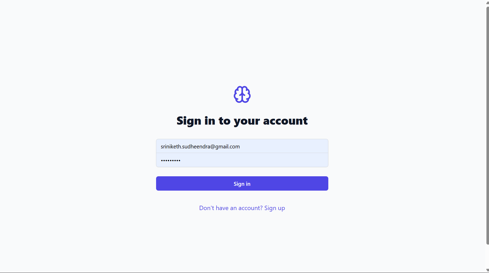
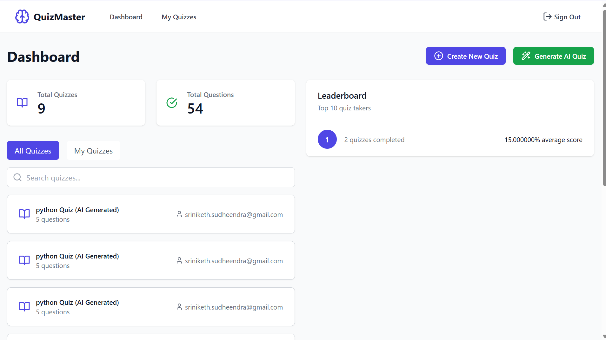
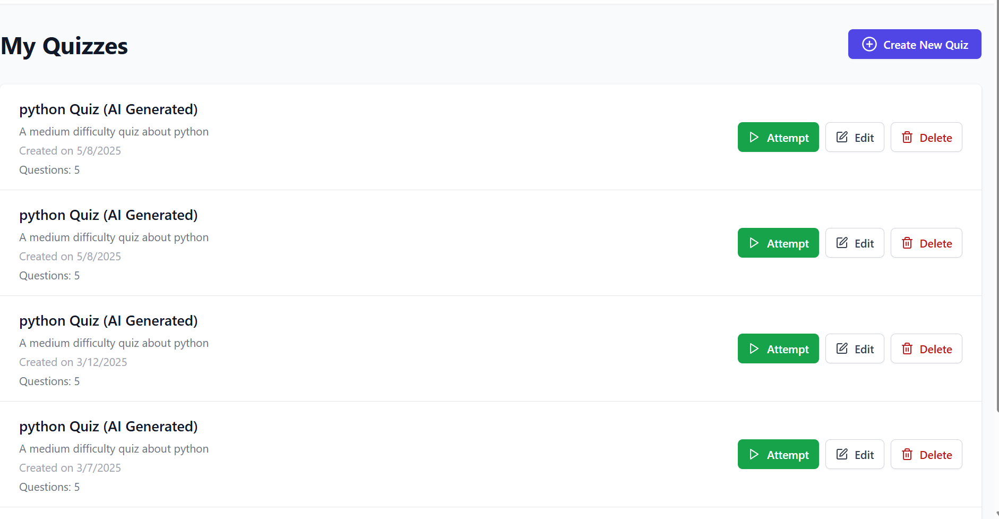

# Quiz Management Application

This repository contains the Quiz Management Application developed by **Sriniketh Sudheendra** and **Sudheer Kumar R** of 4 BCA B.

A full-stack quiz management platform built with **React**, **Vite**, **Node.js**, **Express**, **MongoDB**, and **MySQL**. It supports AI-powered quiz generation, document upload,and much more.

---

## 🔧 Features

- 🔐 JWT-based user authentication  
- 📝 Quiz creation & management  
- 📄 Document upload with auto-generated questions  
- 🤖 AI Quiz Generator (via Mistral API)  
- 💾 Dual DB support: MySQL & MongoDB  
- 💅 Responsive UI with TailwindCSS + Radix UI  
- ⚡ Real-time notifications using `react-hot-toast`  
- 🧑‍💻 Separate dashboards for users and admins  

---

## 🧠 Tech Stack

- **Frontend**: React, Vite, TailwindCSS, Radix UI  
- **Backend**: Node.js, Express  
- **Databases**: MySQL, MongoDB  
- **AI/Cloud Services**: Supabase, Together API  
- **Auth**: JWT  
- **Testing**: Jest, Testing Library  

---

## 🚀 Getting Started

### 1. Clone the Repository, Install Dependencies, and Run the App

```bash
git clone https://github.com/yourusername/quiz-management-application.git
cd quiz-management-application

# Install dependencies
npm install

# Create and edit the environment variables
cp .env.example .env
# Then open .env and fill in your actual credentials

# Run the full-stack application
npm run dev

## 🖼️ Screenshots





